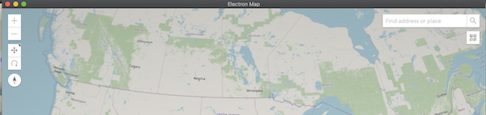

# Electron Map
Cross platform desktop Maps App built with Javascript/HTML/CSS using [Electron](https://electronjs.org/) framework and [ArcGIS JavaScript API](https://developers.arcgis.com/javascript/).



## Features
- Change Basemaps
- Place Search
- Measure (3D)
- Coordinate Conversion

## Requirements
- [Node.js](https://nodejs.org/en/download/) (which comes with [npm](http://npmjs.com))

```bash
# mac homebrew
brew install node
```

## Install Dependencies

```bash
# Install dependencies
npm install
```

## Run the App

```bash
# Run the app
npm start
```

## Licensing
Apache license is available in the repository's [LICENSE](LICENSE) file.
